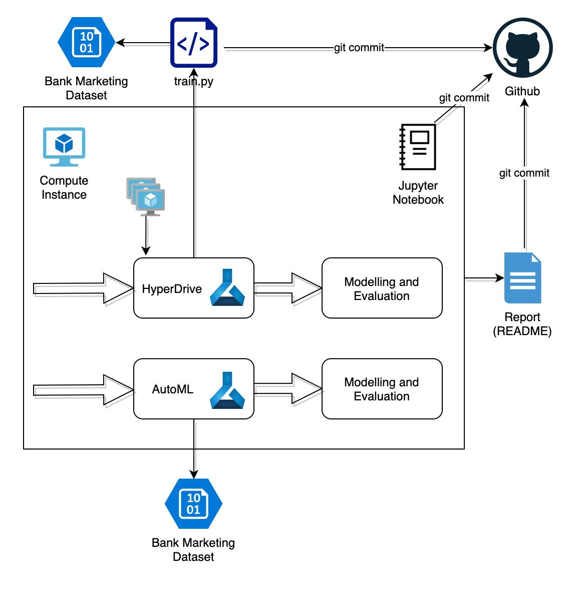
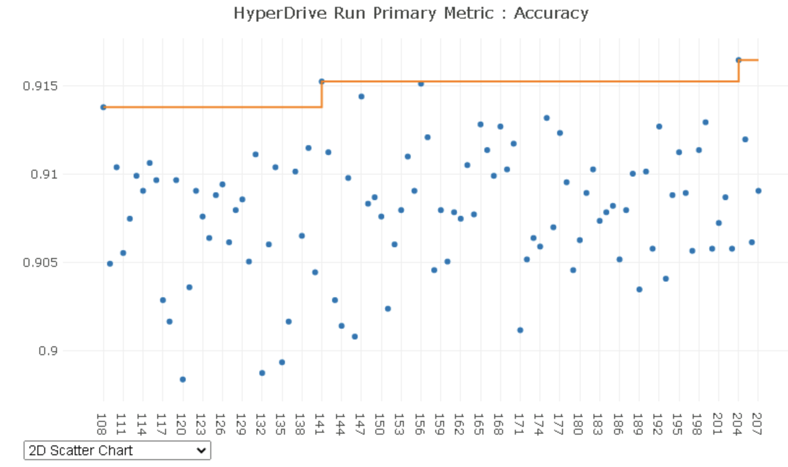
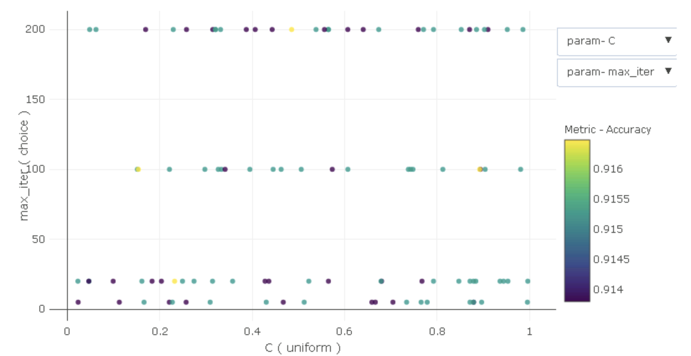
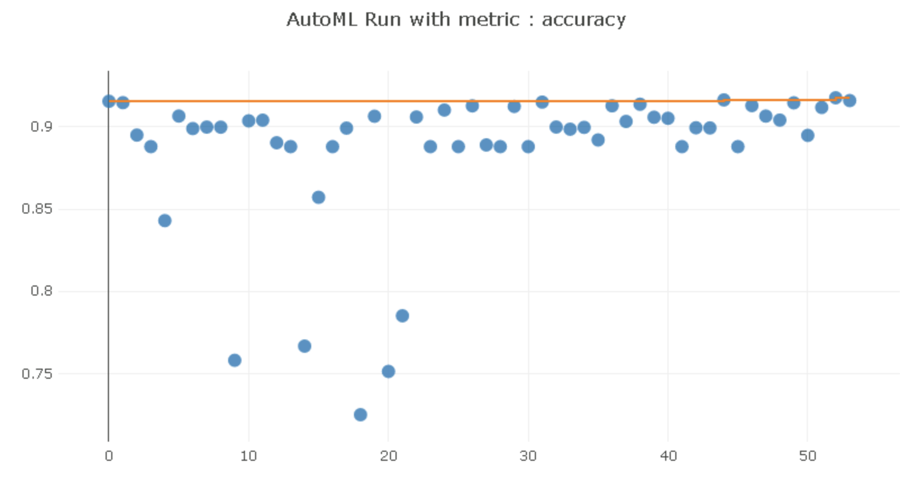
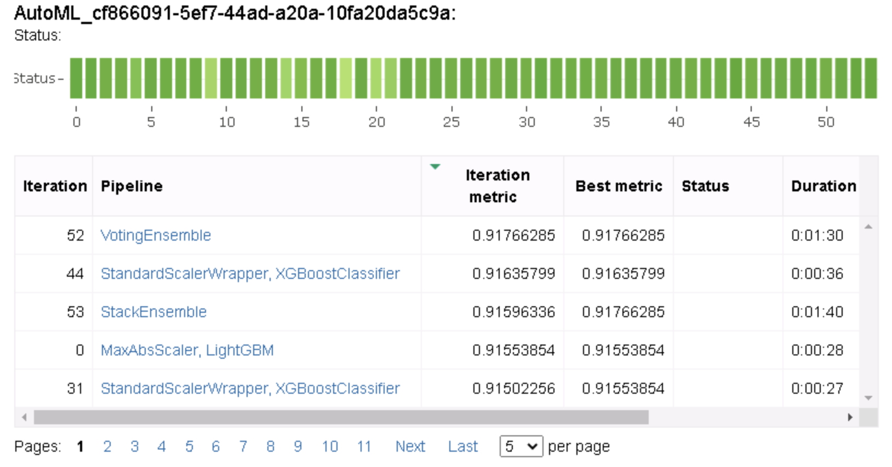

# Optimizing an ML Pipeline in Azure with HyperDrive and AutoML

## Overview
We are going to build and optimize an Azure ML pipeline using the Azure ML Python SDK. The goal is to explore and compare the different features supported by HyperDrive and AutoML for model training.

We are running all steps on a Jupyter Notebook, which will utilise several resources:
- Azure ML Workspace: A Workspace is a logical container for all elements, including the compute resources, experiments, runs, etc.
- Azure ML Compute Instace: Runs the notebook and AutoML
- Azure ML Compute Cluster: Runs HyperDrive
- Azure Blob: Here is the Bank Marketing dataset stored
- train.py: This is the python script with the logistic regression training algorithm based on Sci-Kit Learn

Once the Notebook has run and we have results, we save them and create this report you are reading. All artifacts mentioned are commited to Github.

An overview of the setup can be seen below

## Introduction
We are using a [Dataset](https://archive.ics.uci.edu/ml/datasets/Bank+Marketing) distributed and maintained by the University of California Irvine. This dataset was generated by a Portuguese banking institution classifying which marketing campaigns in the form of phone calls resulted in closing a deposit contract. The dataset records personal parameters of the participants of the marketing campaign like the job, education, marital status, economic situation (loans, owned housing, ) as well as other parameters related to the call and offered product, like date, time and duration of the call, employee number and euribor value.

## Problem statement
In this project we want to use the previously described dataset as an example of a realistic data science problem, so that we can answer the next questions: Which of the two services, Azure HyperDrive and Azure AutoML are appropriate for such a data science problem? Under which circumstances should we use one or the other?

## HyperDrive pipeline with logistic regression
HyperDrive is a tool available in the Azure ML toolset, which allows to simplify the hyperparameter search. In this case, we are responsibile to decide the algorithm(s) to be used, while HyperDrive acts as a wrapper to automate the runs with different hyperparameters. A simple logistic regression built with sci-kit learn is used, while the hyperparameters to optimize are the regularization strength and the number of iterations.

HyperDrive allows us to configure the next options: sampling and policy for early stopping 

### Hyperparameter sampling
In order to choose the hyperparameters to be used for running the logistic regression algorithm, we can choose any of the next 3 search options:
- Grid search: it tries all combinations available. Only discrete parameters can be chosen (using "choice")
- Random search: it samples randomly in the hyperparameter space defined. Both discrete and continuous parameter ranges are supported. By using this method, we are adding some level of variability over Grid search, which will restrict the search to the combinations pre-defined by the data scientist. It is therefore preferred to do a Random search over Grid search.
- Bayesian search: it considers performance of previous runs to select the next hyperparameters. This is therefore an efficient search method. On the other hand, given its execution in series nature, early stopping is not supported. Early stopping is explained in the next chapter

We would like to execute several runs in parallel and use early stopping, we are using *Random Search*. In addition to this, we define the search space:
- Regularization strength: range from 0.001 and 1.0 with uniform distribution
- Number of iterations: discrete values 5, 20, 100 and 200

### Policy for early stopping
HyperDrive allows us to stop runs which results are not good enough. the next options are available:
- Bandit policy: it stops a run if it underperforms the best run by a defined value called "Slack"
- Median stopping policy: it stops the run if its performance is below the average for all the runs
- Truncation selection policy: it stops the lowest performing runs decided by a configurable parameter called "Truncation percentage"
- No termination

Although all early stopping policies are suitable options (except no termination), we are choosing the "Bandit policy" because it allows us to keep the top performance runs continue until the end.

## AutoML
AutoML is suitable for any classification, regression or forecasting problem, where we are not sure where to start or have no time to manually try different algorithms. AutoML tries 17 different algorithms combined with scaling and normalization and ensemble methods without any manual intervention. At the end, we can select the best performing run and save the generated model. We only need to define how much time (=money) we want it to continue trying to improve the performance.

In our case we are going to limit the experiment timeot to 30 minutes.

## HyperDrive and AutoML results
Both HyperDrive and AutoML have reached very similar accuracy: 91.65% and 91.77% respectively.

### HyperDrive results
After 100 runs, the hyperparameters with the highest performance were:
- Regularization strength: 0.232
- Number of iterations: 20

In the graph below we see the 100 runs and their accuracy achieved. As we expected with random search, the accuracy goes up and down randomly.

Plotting in the same picture the hyperparameters, regularization strength (C) and number of iteration, together with accuracy, we should be able to see any correlation. However, we can see below that this is not the case.

### AutoML results
AutoML run for 53 runs until the timeout expired. The results were slightly better than HyperDrive, which could be explained if we consider the wide range of algorithms tested. However it might be disappointing that no better result was achieved.

As we see below, AutoML tries algorithms with varying results at the beginning, while at the end only very good performing iterations were run

In the next picture we see sorted by accuracy the top performing iterations and the related algorithm

## HyperDrive Vs AutoML. Which one should we use?
As shown above, both HyperDrive and AutoML achieve a similar result and we can therefore state that both are suitable for this problem and dataset.

In other to be able to choose which of the 2 should be used, we propose the next guidelines:
- HyperDrive: If we know which algorithm works for a defined problem and we just want to try many different hyperparameters, HyperDrive is a great tool. Although in this study we have used logistic regression, other algorithms which require more computing power are even more appropriate for HyperDrive, for example Deep Neural Networks
- AutoML: In the case we want to achieve with minimal effort a competitive result, AutoML is a fantastic tool. We consider however that Deep Neural Networks are not used by AutoML, therefore limiting the highest performance for complex problems.

## Future work
While both tools are useful, we miss the inclusion and possible impact in the results of Deep Neural Networks (DNNs), which have recently shown very high potential for the most complex problems. HyperDrive could be used for Neural Architecture Search (NAS) and rest of usual hyperparameters (learning rate, loss algorithm parameters, etc.)